<div id="top"></div>

<!-- PROJECT Intro -->
<br />
<div align="center">
  <a href="https://lern.pages.dev/" target="_blank">
    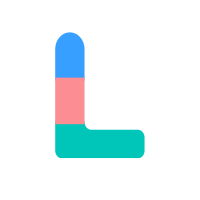
  </a>
    <h1>Lern</h1>
  <h3>🏆 Winner of the Atlas Madness Hackathon 2023 by Google and MongoDB</h3>
</div>

<!-- ABOUT THE PROJECT -->

## About The Project

<a href="https://lern.pages.dev/" target="_blank">
    
</a>

<!-- PROJECT SHIELDS -->


Welcome to **Lern**, the revolutionary learning platform that empowers users to explore and master any topic of their choice instantly. Leveraging the power of Google's Bard, Lern harnesses the cutting-edge capabilities of artificial intelligence to generate comprehensive courses tailored to individual learning needs. Say goodbye to lengthy search sessions and scattered resources – with Lern, knowledge is just a few clicks away!

App: https://lern.pages.dev/
 

**Features of our application**:

Lern is packed with features designed to enhance the learning experience and provide users with a seamless educational journey. Here are some of the key highlights:

- **Course Generation**: Users can unleash their curiosity and thirst for knowledge by simply inputting their desired topic. Lern's intelligent algorithms powered by Google's Bard will instantly generate comprehensive and well-structured courses, ensuring a well-rounded understanding of the subject matter.

- **Chapter-Based Learning**: Courses are divided into chapters, making it easy for users to navigate and digest information in manageable portions. Each chapter comes with its own set of learning materials, including text, images, and multimedia resources.

- **Interactive Quizzes**: Lern goes beyond passive learning by offering chapter-specific quizzes. Users can test their knowledge, reinforce concepts, and track their progress as they complete each chapter. The quizzes provide an engaging and interactive learning experience.

- **Insights and Progress Tracking**: Lern's Insights page empowers users to monitor their learning progress effectively. They can track course completion, review quiz scores, and identify areas where they excel or need further improvement, enabling personalized learning paths.

- **User-Friendly Dashboard**: Lern's intuitive dashboard provides users with a centralized hub for easy navigation, offering quick access to courses, quizzes, and insights. The clean and responsive design ensures a delightful user experience across various devices.

- **Secure and Convenient Authentication**: Experience the convenience of passwordless authentication with Magic.link. Sign in to Lern hassle-free, with the assurance of a secure and reliable authentication process.

<p align="right">(<a href="#top">back to top</a>)</p>

## Screenshots

Here is a sneak peek of the application and it's visuals 😍:

<table>
    <tr>
        <td width="50%">
            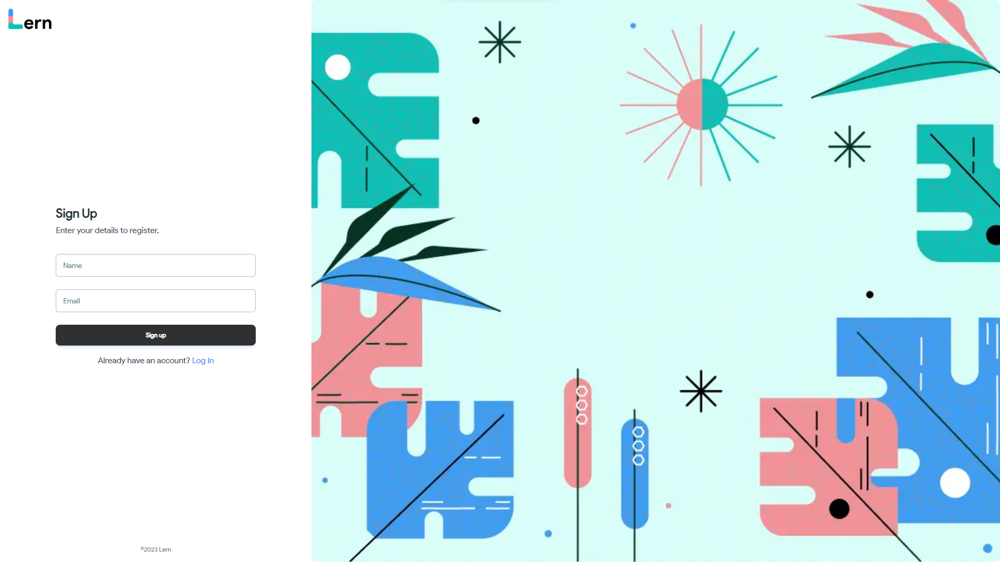
            <br />
            <p align="center">Registration</p></td>
        <td width="50%">
            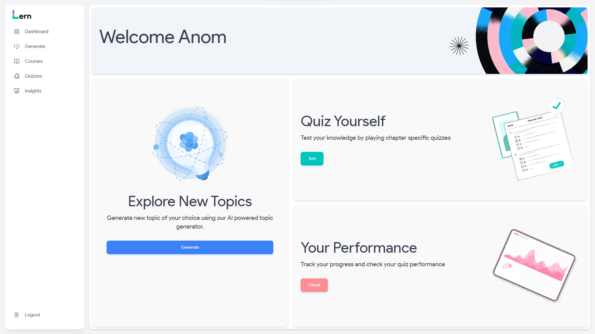
            <br />
            <p align="center">Dashboard</p></td>
    </tr>
    <tr>
        <td width="50%">
            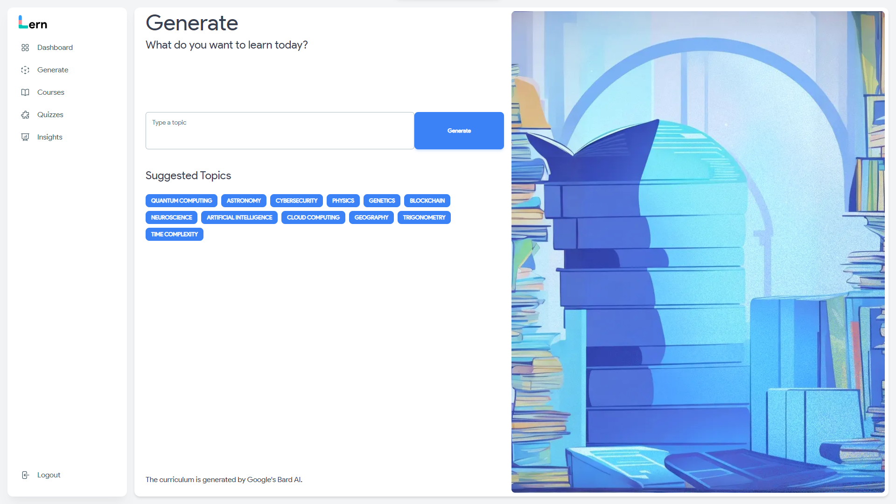
            <br />
            <p align="center">Generate Course</p></td>
        <td width="50%">
            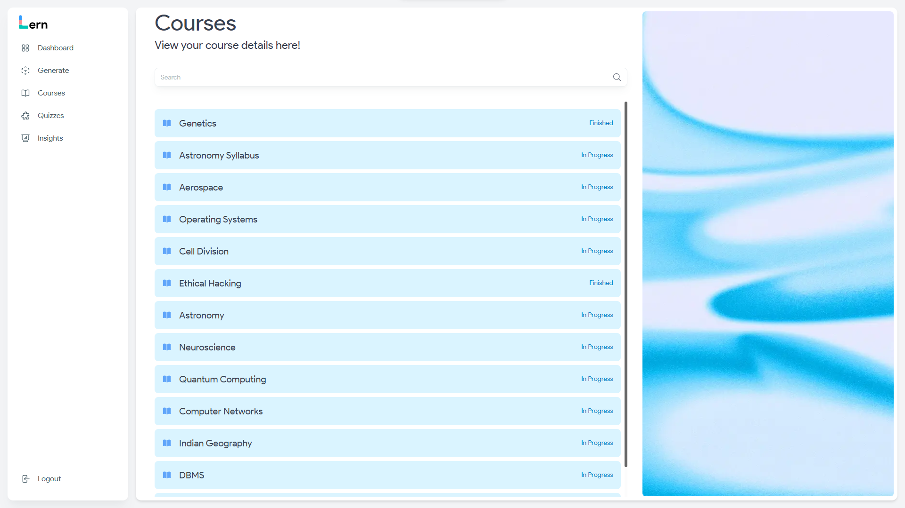
            <br />
            <p align="center">All Courses</p></td>
    </tr>
    <tr>
        <td width="50%">
            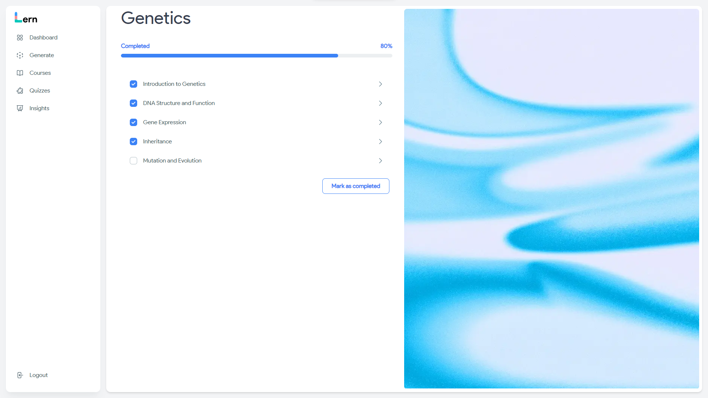
            <br />
            <p align="center">Course</p></td>
        <td width="50%">
            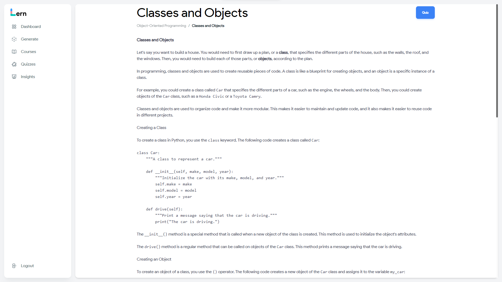
            <br />
            <p align="center">Chapter</p></td>
    </tr>
    <tr>
        <td width="50%">
            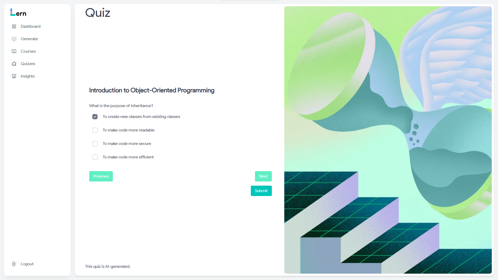
            <br />
            <p align="center">Quiz</p></td>
        <td width="50%">
            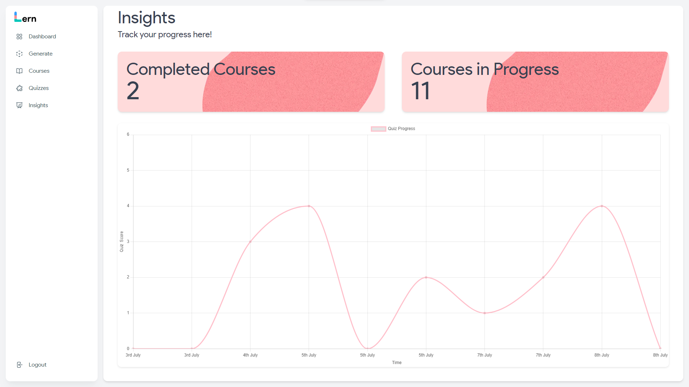
            <br />
            <p align="center">Insights</p></td>
    </tr>
</table>


<p align="right">(<a href="#top">back to top</a>)</p>


<!-- GETTING STARTED -->

# Quick Start Guide

To get started with having your own instance of Lern, follow these steps described in the following section.

## Prerequisites

You will need these to be already installed:

- [NodeJS](https://nodejs.org/) 16+ and [NPM](https://npmjs.com/)

And that's it

## Installation

Follow these steps to get started


```bash
# Clone the repository
git clone https://github.com/anomic30/Lern.git
# Enter into the frontend directory
cd Lern/client
# Install the dependencies
npm install
# Enter into the server directory
cd Lern/server
# Install the dependencies
npm install
```
### ⚠️ Important!
In order to use this for your own purpose, you need the API keys.
For the passwordless authentication, grab the API keys from [Magic](https://magic.link/). For the MongoDB, create a [MongoDB](https://www.mongodb.com/atlas/database) Atlas server and setup the env variables accordingly. And for the Bard API key, get it from the [Google Makersuite](https://makersuite.google.com/app/apikey).

### Starting the application

```bash
# To run the frontend
npm run dev
# To run the backend
npm run dev
# To build the frontend
npm run build
```

<p align="right">(<a href="#top">back to top</a>)</p>


# How it works

Here's a diagram explaining exactly how everything fits into place

<div align="center">
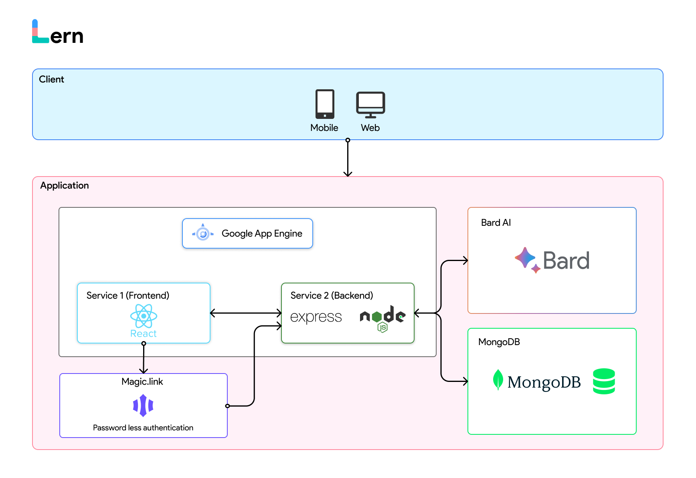

</div>

<!-- LICENSE -->

<!-- # 📄 License

Distributed under the MIT License. See [`LICENSE.md`](LICENSE.md) for more information. -->

<p align="right">(<a href="#top">back to top</a>)</p>

# Our Team

<div align="center">
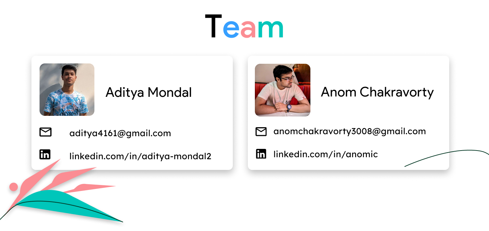
</div>


# Endnote

We welcome contributions to Lern! Help us shape the future of instant learning by contributing to our GitHub repository. Together, let's empower learners worldwide.

<p align="right">~ Lern team</p>
